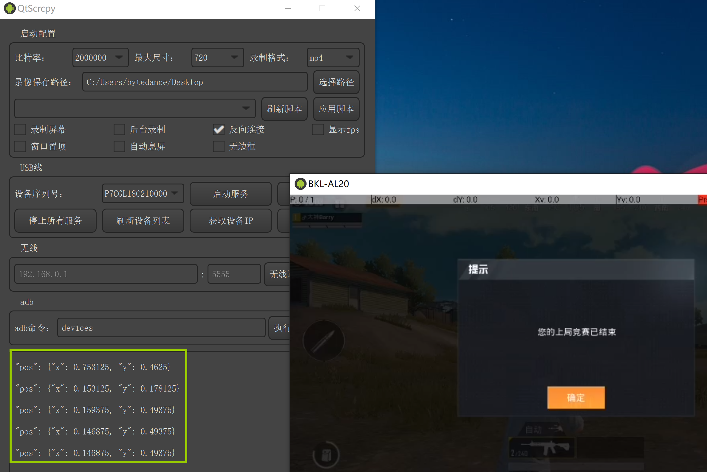

# Custom key mapping instructions

The key map file is in json format, and the new key map file needs to be placed in the keymap directory to be recognized by QtScrcpy.

The specific writing format of the button mapping file will be introduced below, and you can also refer to the button mapping file that comes with it.

## Key mapping script format description

### General Instructions

-The coordinate positions in the key map are all expressed by relative positions, and the width and height of the screen are expressed by 1, for example, the pixels of the screen are 1920x1080, then the coordinates (0.5,0.5) indicate
Taking the upper left corner of the screen as the origin, the position of the pixel coordinates (1920,1080)*(0.5,0.5)=(960,540).
    
    Or when the left mouse button clicks, the console will output the pos at this time, just use this pos directly
    

-The key codes in the key map are represented by Qt enumerations, detailed description can be [refer to Qt documentation](https://doc.qt.io/qt-5/qt.html) (search for The key names used by Qt. can be quickly located).
-Open the following two settings in the developer options, you can easily observe the coordinates of the touch point:

### Mapping type description

-switchKey: Switch the key of the custom key mapping. The default is the normal mapping. You need to use this key to switch between the normal mapping and the custom mapping.

-mouseMoveMap: mouse movement mapping, the movement of the mouse will be mapped to startPos as the starting point, and the direction of the mouse movement as the direction of the finger drag operation (after the mouse movement map is turned on, the mouse will be hidden, limiting the range of mouse movement).
Generally used to adjust the character field of vision in FPS mobile games.
    -startPos finger drag starting point
    -speedRatio mouse sensitivity of the finger dragging. The value must be at least 0.00225. The greater the value, the lower the sensitivity. The Y-axis translates with a ratio of 2.25. If this does not fit your phone screen, please use the following two settings to set individual sensitivity values.
    -speedRatioX sensitivity of the mouse X-axis. This value must be at least 0.001.
    -speedRatioY sensitivity of the mouse Y-axis. This value must be at least 0.001.
    -smallEyes The button that triggers the small eyes. After pressing this button, the mouse movement will be mapped to the finger drag operation with the smallEyes.pos as the starting point and the mouse movement direction as the movement direction

-keyMapNodes general key map, json array, all general key maps are placed in this array, map the keys of the keyboard to ordinary finger clicks.

There are several types of key mapping as follows:

-type The type of key mapping, each element in keyMapNodes needs to be specified, and can be of the following types:
    -KMT_CLICK Ordinary click, key press simulates finger press, key lift simulates finger lift
    -KMT_CLICK_TWICE Double click, key press simulates finger press and then lift, key lift simulates finger press and then lift
    - KMT_CLICK_MULTI Click multiple times. According to the delay and pos in the clickNodes array, press one key to simulate touching multiple positions
    -KMT_DRAG drag and drop, the key press is simulated as a finger press and drag a distance, the key lift is simulated as a finger lift
    -KMT_STEER_WHEEL steering wheel mapping, which is dedicated to the mapping of the steering wheel for moving characters in FPS games, requires 4 buttons to cooperate.

Description of the unique attributes of different key mapping types:

-KMT_CLICK
    -key The key code to be mapped
    -pos simulates the location of the touch
    -Whether the switchMap releases the mouse. After clicking this button, besides the default simulated touch map, whether the mouse operation is released. (You can refer to the effect of M map mapping in Peace Elite Map)

-KMT_CLICK_TWICE
    -key The key code to be mapped
    -pos Simulates the location of the touch

-KMT_CLICK_MULTI
    -delay Delay `delay` ms before simulating touch
    -pos Simulates the location of the touch

-KMT_DRAG
    -key The key code to be mapped
    -startPos Simulate the start position of touch drag
    -endPos Simulate the end position of touch drag

-KMT_STEER_WHEEL
    -centerPos steering wheel center point
    -leftKey key control in the left direction
    -rightKey Right key control
    -UpKey key control
    -downKey key control in down direction
    -leftOffset After dragging the left arrow key, drag to the leftOffset horizontally to the centerPos
    -rightOffset After pressing the right direction key, drag it to the right offset of the center to the right of the centerPos position
    -upOffset After pressing the up arrow key, drag it to the upper offset position horizontally relative to the centerPos position
    -downOffset Press the down arrow key and drag it to the downOffset position horizontally relative to the centerPos position
